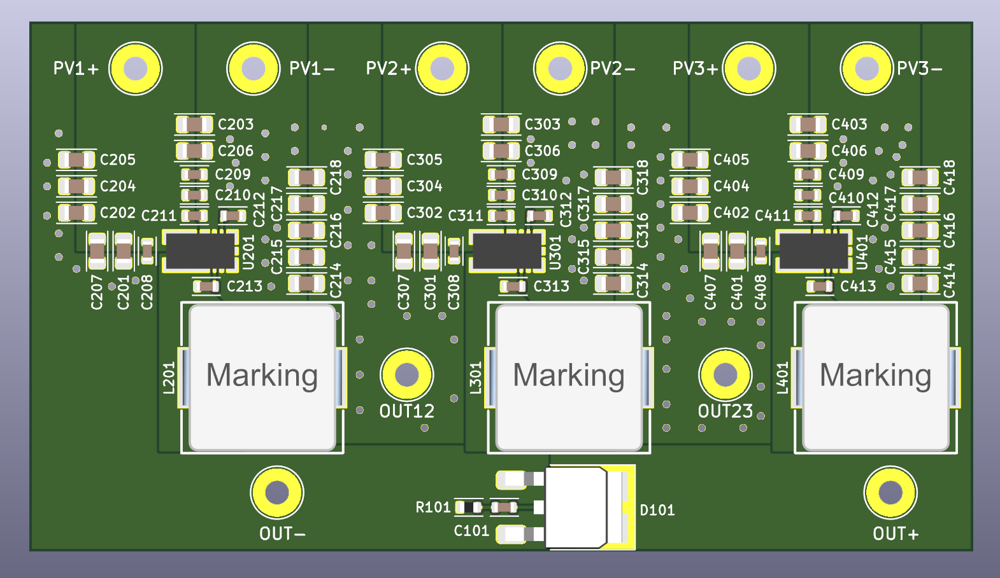
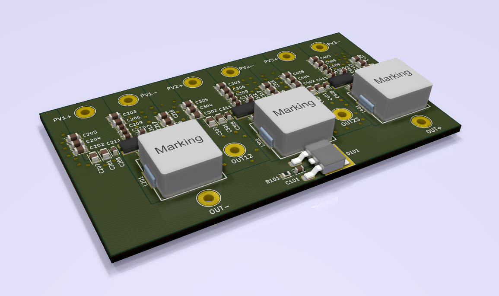

# Maxim Optimizer

This KiCad project implements a solar cell optimizer based on the Maxim MAX20801 step down controller with integreated MPPT. 

It's inputs are connected to 3 arrays of 20 to 24 solar cells, they have to be isolated on the input side of the optimizer. 

The outputs of the 3 step down controllers are connected in series. 

This kind of optimizer maximizes the output power for each cell array individually, and words perfectly if some solar modules are shaded partially in a string of many modules. 

